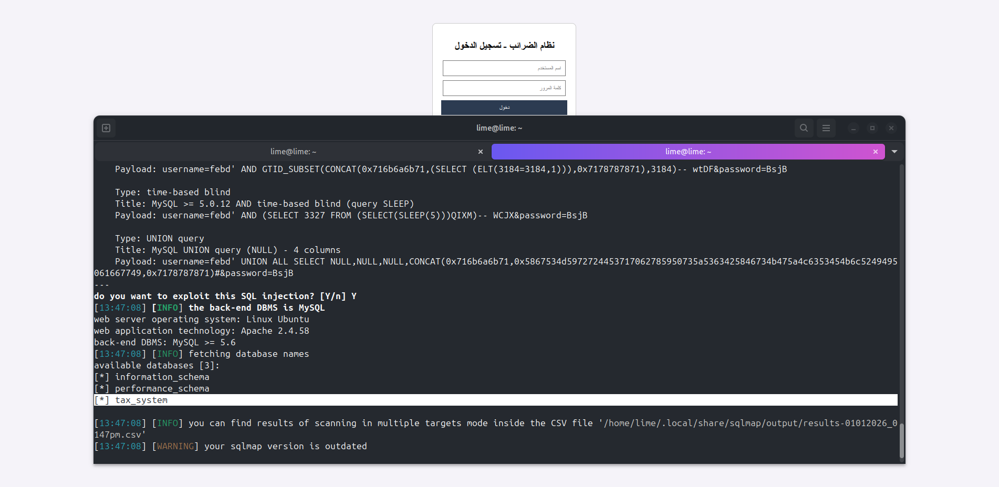
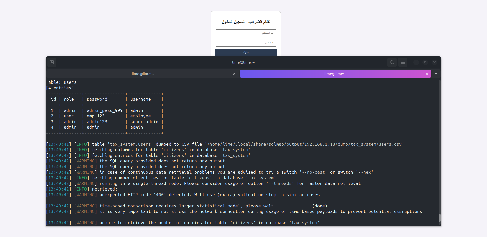
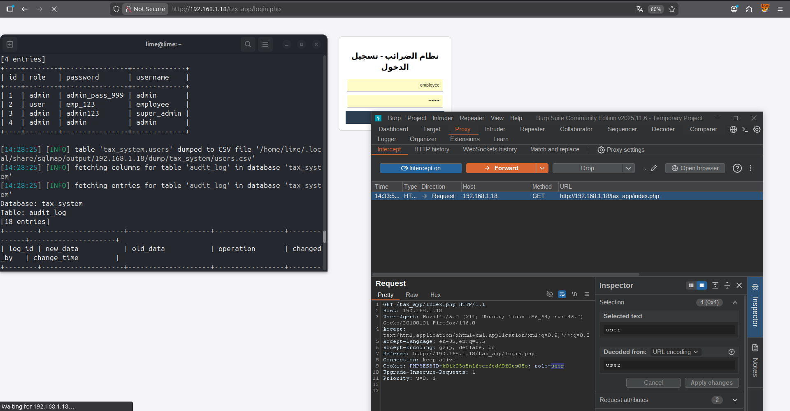
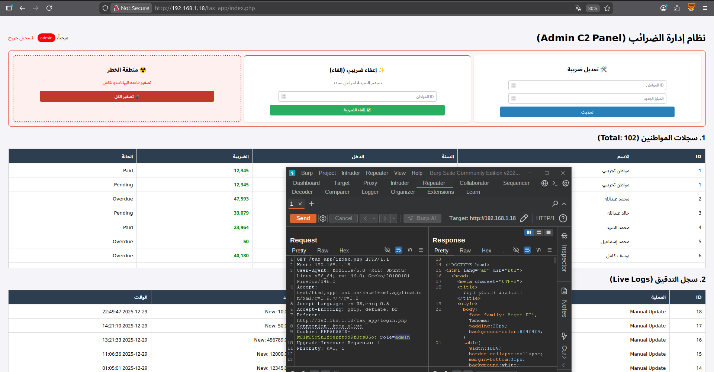
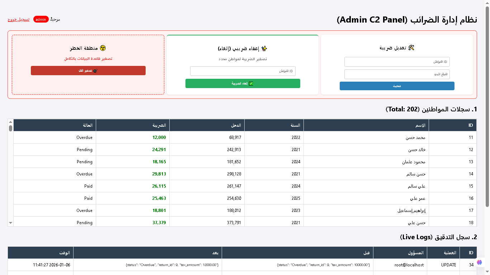
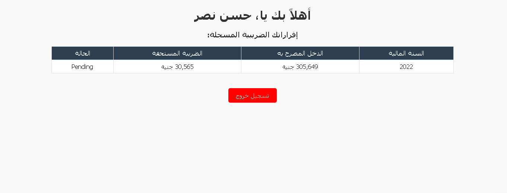

# Tax Management System (PHP)

A PHP & MySQL-based tax management system designed for managing tax records with authentication and dashboards.


## Screenshots:

**sqlmap**





**Burp Suite**




**Admin Dashboard** 


**User Dashboard**




# 🏦 Vulnerable Tax Management System (CTF Lab)


A purpose-built vulnerable web application simulating a **Tax Management System**. This project is designed as a **Penetration Testing Lab** to practice SQL Injection, Privilege Escalation, and Broken Access Control.

It features a hidden **Admin C2 Panel** capable of wiping out tax debts or modifying records, monitored by a database trigger-based audit log that attempts to mask administrative actions.

---

## ⚠️ Disclaimer
**FOR EDUCATIONAL PURPOSES ONLY.**
This software contains intentional security vulnerabilities. DO NOT run this on a public server or production environment. The author is not responsible for any misuse or damage caused by this program.

---

## 🕵️‍♂️ Features

### Core Functionality
* **Role-Based Access Control (RBAC):** Separate dashboards for Employees (Read-only) and Admins (Full Control).
* **Tax Records Management:** View citizens' income, tax status, and pending debts.
* **Audit Logging:** Real-time MySQL triggers log every change made to sensitive data, tracking the "Old" vs "New" values.

### 💀 Admin C2 Panel (The "Dark" Side)
* **☢️ Nuke All Taxes:** A "Doomsday" button to zero out tax debts for ALL citizens instantly.
* **✨ Tax Waiver:** A function to wipe debt for a specific target ID.
* **🛠️ Modify Records:** Manually update tax values for any citizen ID.
* **Stealth Mode:** The system logs admin actions as "System Admin" to appear legitimate in forensic logs.

---

## 🐛 Intended Vulnerabilities (Writeups)

### 1. SQL Injection (SQLi)
* **Location:** `login.php`
* **Vulnerable Parameter:** `username`
* **Description:** The login form executes raw SQL queries without sanitization or prepared statements.
* **Attack Vector:**
    ```sql
    ' OR '1'='1
    ```
    *Tools:* `sqlmap` can be used to dump the entire database tables and credentials.

### 2. Privilege Escalation (Insecure Cookies)
* **Location:** `index.php`
* **Vulnerability:** The application relies on an unencrypted client-side cookie (`role`) to determine user privileges.
* **Attack:**
    1. Login as a normal employee.
    2. Intercept the request using **Burp Suite** or edit cookies via Browser DevTools.
    3. Change `Cookie: role=user` to `Cookie: role=admin`.
    4. Gain full access to the Admin C2 Panel.

### 3. Broken Access Control
* **Location:** Admin Actions (POST Requests).
* **Vulnerability:** Sensitive actions (like `nuke_all` or `waiver_tax`) rely solely on the easily forged cookie for authorization.

---

## 🛠️ Installation & Setup

### Prerequisites
* Linux (Ubuntu/Kali).
* Apache2, PHP, MySQL (LAMP Stack).

### Step-by-Step Guide

**1. Set up the project directory:**
```bash
mkdir -p /var/www/html/tax_app
# Copy the source code files into this directory

2. Configure the Database: Login to MySQL:
sudo mysql -u root -p

Run the following SQL commands:
CREATE DATABASE tax_system;
CREATE USER 'tax_admin'@'localhost' IDENTIFIED BY '123456';
GRANT ALL PRIVILEGES ON tax_system.* TO 'tax_admin'@'localhost';
FLUSH PRIVILEGES;

3. Generate Fake Data: Navigate to the seeding script in your browser to generate 100 random citizens: http://localhost/tax_app/seed_data.php

4. Set Permissions: Ensure Apache can read the files:
chown -R www-data:www-data /var/www/html/tax_app
chmod -R 755 /var/www/html/tax_app

🎮 Lab Usage
Default Credentials
----------------------------------------------------------------|
Role,Username,Password,Notes                                    |
Super Admin,super_admin,admin123,Has full access to C2 Panel    |
Admin,admin,admin_pass_999,Has full access                      |
Employee,employee,emp_123,Read-only access (Target for PrivEsc) |
----------------------------------------------------------------|

Testing with Kali Linux Tools
Automated SQL Injection:

sqlmap -u "http://target-ip/tax_app/login.php" --forms --dbs --batch

Brute Force Attack:

hydra -l super_admin -P /usr/share/wordlists/rockyou.txt target-ip http-post-form "/tax_app/login.php:username=^USER^&password=^PASS^:F=بيانات الدخول غير صحيحة"

🏗️ Tech Stack
Backend: PHP 8.x (Native)

Database: MySQL / MariaDB (PDO Driver)

Frontend: HTML5, CSS3

Server: Apache HTTP Server

------------------- final -------------------

Happy Hacking! 🏴‍☠️